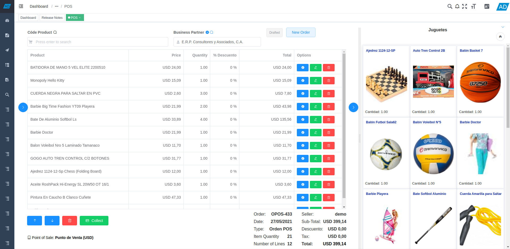

<p align="center">
  
</p>

<p align="center">
  <a href="https://github.com/vuejs/vue">
    
  </a>
  <a href="https://github.com/ElemeFE/element">
    
  </a>
  <a href="https://github.com/adempiere/adempiere-vue/actions/workflows/publish.yml">
    
  </a>
  <a href="https://github.com/adempiere/adempiere-vue/blob/develop/LICENSE">
    
  </a>
  <a href="https://github.com/adempiere/adempiere-vue/releases/latest">
    
  </a>
</p>


English | [Spanish](./README.es.md)

## Introduction

[adempiere-vue](https://github.com/adempiere/adempiere-vue) is a modern UI for [ADempiere ERP, CRM & SCM](https://github.com/adempiere/adempiere). It is based on [vue](https://github.com/vuejs/vue) and uses the UI toolkit [element-ui](https://github.com/ElemeFE/element).



It is a great UI for [ADempiere ERP, CRM & SCM](https://github.com/adempiere/adempiere) based on the newest development stack of vue, built-in i18n solution, typical templates for enterprise applications, and lots of awesome features. This project was forked from [Vue-Element-Admin](https://github.com/PanJiaChen/vue-element-admin) originally written by [PanJiaChen / 花裤衩](https://github.com/PanJiaChen) under the [MIT license](https://github.com/PanJiaChen/vue-element-admin/blob/master/LICENSE) and was changed to [GNU/GPL v3](https://github.com/adempiere/adempiere-vue/blob/develop/LICENSE) by [Yamel Senih](https://github.com/yamelsenih) after forking, granted by [PanJiaChen / 花裤衩](https://github.com/PanJiaChen) on issue ["Extend as GNU/Gpl v3 License #1434"](https://github.com/PanJiaChen/vue-element-admin/issues/1434).

[adempiere-vue](https://github.com/adempiere/adempiere-vue) uses the modern open source high performance RPC framework [gRPC](https://grpc.io/) via [adempiere-grpc-server](https://github.com/adempiere/adempiere-grpc-server).

- [Documentation](https://adempiere.github.io/adempiere-vue/)

- [Donate](https://www.paypal.me/YamelSenih)

- [Forked From](https://github.com/PanJiaChen/vue-element-admin)


**The current version is `v1.0+` built on `vue-cli`. If you find a problem, please open an [issue](https://github.com/adempiere/adempiere-vue/issues/new).**

**This project does not support low version browsers (e.g. IE). Please add polyfill by yourself.**

## Preparation

You need to install [node](https://nodejs.org/) and [git](https://git-scm.com/) locally. The project is based on [ES2015+](https://es6.ruanyifeng.com/), [vue](https://cn.vuejs.org/index.html), [vuex](https://vuex.vuejs.org/zh-cn/), [vue-router](https://router.vuejs.org/zh-cn/), [vue-cli](https://github.com/vuejs/vue-cli), [gRPC](https://grpc.io/) and [element-ui](https://github.com/ElemeFE/element).
Understanding and learning this knowledge in advance will greatly help the use of this project.

<p align="center">
  
</p>

## Run Docker container

### Minimal Docker Requirements

To use this Docker image you must have your Docker engine version greater than or equal to 3.0.

Download Docker image:
```bash
docker pull ghcr.io/adempiere/adempiere-vue
```

Run container:
```bash
docker run -it \
	--name adempiere-vue \
	-p 80:80 \
	-e API_URL="http://localhost:8080/api/" \
	-e TZ="America/Caracas" \
	ghcr.io/adempiere/adempiere-vue
```

Or run using `docker-compose`:
```bash
docker-compose up
```

### Environment variables

 * `PUBLIC_PATH`: You will need to set publicPath if you plan to deploy your site under a sub path, for example GitHub Pages. If you plan to deploy your site to `https://adempiere-vue.github.io/bar/`, then publicPath should be set to `/bar/`. In most cases please use `/`.

 * `API_URL`: Indicates the address of the server running [ADempiere-UI-Gateway](https://github.com/adempiere/adempiere-ui-gateway). Default value: `http://localhost:8080/api/`.

 * `TASK_MANAGER_URL`: Indicates the address of the API RESTFul for the task manager [ADempiere-Business-Processors](https://github.com/adempiere/adempiere-business-processors) and [`dKron`](https://dkron.io/). Default value: `http://localhost:8080/v1`.

 * `TZ`: (Time Zone) Indicates the time zone to set in the nginx-based container. Default value: `America/Caracas` (UTC -4:00).

> **Note**
> If you do not change the values of the environment variables, it is not necessary to indicate them in the `docker run` command, since the default values will be set.


## Sponsors

<a href="http://erpya.com/">
  
</a>
<a href="http://westfalia-it.com/">
  
</a>
<a href="http://openupsolutions.com/">
  
</a>

Become a sponsor and get your logo on our README on GitHub with a link to your site. [Become a sponsor](https://www.paypal.me/YamelSenih)

## Features

```
- Login / Logout
- Register
- Forgot Password

- Permission Authentication
  - ADempiere backend permission
  - Page permission
  - Directive permission
  - Permission configuration page

- Multi-environment build
  - Develop (dev)
  - sit
  - Stage Test (stage)
  - Production (prod)

- Global Features
  - I18n
  - Multiple dynamic themes
  - Dynamic sidebar (supports multi-level routing)
  - Dynamic breadcrumb
  - Tags-view (Tab page Support right-click operation)
  - Svg Sprite
  - Screenfull
  - Responsive Sidebar

- Editor
  - Rich Text Editor
  - Markdown Editor
  - JSON Editor

- Excel
  - Export Excel
  - Upload Excel
  - Visualization Excel
  - Export zip

- Table
  - Dynamic Table
  - Drag And Drop Table
  - Inline Edit Table

- Error Page
  - 401
  - 404

- Components
  - Avatar Upload
  - Back To Top
  - Drag Dialog
  - Drag Select
  - Drag Kanban
  - Drag List
  - SplitPane
  - Dropzone
  - Sticky
  - CountTo

- ADempiere supported
  - Window
  - Process
  - Report
  - Smart Browser
  - Form
  - Workflow

- Advanced Example
- Error Log
- Dashboard
- Guide Page
- ECharts
- Clipboard
- Markdown to html
```

## Getting started

Use [gRPC ADempiere Server](https://github.com/adempiere/adempiere-grpc-server) as gRPC provider.

```bash
# Enable https to install packages
git config --global url."https://".insteadOf git://

# clone the project
git clone https://github.com/adempiere/adempiere-vue.git

# enter the project directory
cd adempiere-vue

# install dependency (yarn install --frozen-lockfile)
yarn ci

# run project as develop
yarn dev
```

This will automatically open http://localhost:9527

## Build

```bash
# build for test environment
yarn build:stage

# build for production environment
yarn build:prod
```

## Advanced

```bash
# preview the release environment effect
yarn preview

# preview the release environment effect + static resource analysis
yarn preview --report

# code format check
yarn lint

# code format check and auto fix
yarn lint --fix
```

Refer to [Documentation](https://adempiere.github.io/adempiere-vue/) for more information


## Changelog

Detailed changes for each release are documented in the [release notes](https://github.com/adempiere/adempiere-vue/releases).

## Donate

If you find this project useful, you can help make a better UI.

[Paypal Me](https://www.paypal.me/YamelSenih)

### Some Contributors
Thanks for any effort to improve this great project. The following are some companies that have helped make this the best software possible.

<table>
  <tbody>
    <tr>
      <td align="center" valign="middle">
        <a href="www.vdevsoft.com">
          
        </a>
      </td>
    </tr>
  </tbody>
</table>

## Browsers support

Modern browsers and Internet Explorer 10+

| [](https://godban.github.io/browsers-support-badges/)</br>IE / Edge | [](https://godban.github.io/browsers-support-badges/)</br>Firefox | [](https://godban.github.io/browsers-support-badges/)</br>Chrome | [](https://godban.github.io/browsers-support-badges/)</br>Safari |
| --------- | --------- | --------- | --------- |
| IE10, IE11, Edge | last 2 versions | last 2 versions | last 2 versions |

## License

[GNU/GPL v3](https://github.com/adempiere/adempiere-vue/blob/develop/LICENSE)

## Previous License
[MIT](./PREVIOUS-LICENSE)

## Initial Contributors

- [Yamel Senih](https://github.com/yamelsenih)
- [Raúl Muñoz](https://github.com/Raul-mz)
- [Edwin Betancourt](https://github.com/EdwinBetanc0urt)
- [Leonel Matos](https://github.com/leonel1524)
- [Elsio Sanchez](https://github.com/elsiosanchez)
